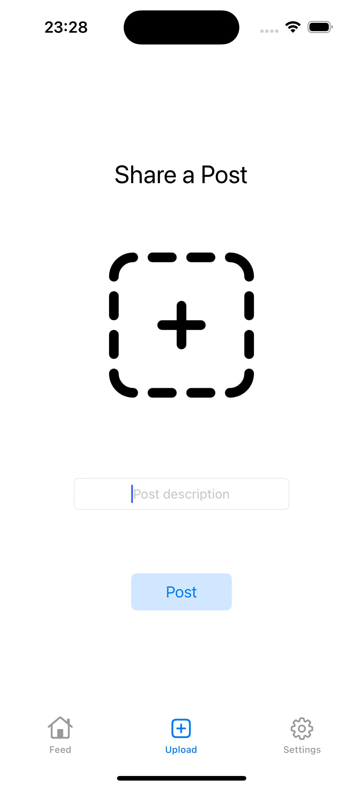

# SocialMediaApp

SocialMediaApp is a modern social media application where users can share photos, and interact with other users. This app is developed using powerful technologies like Firebase Authentication, Firestore, Firebase Storage, and SDWebImage.

## Features

- **User Authentication (Firebase Auth):** Secure registration and login with email and password. Also, quick login support with social media accounts (Google, Facebook, etc.).
- **Real-time Database (Firestore):** Store and update user data and posts in real-time.
- **Media Storage (Firebase Storage):** Secure and scalable storage for user-uploaded photos and videos.
- **Image Optimization (SDWebImage):** Fast and efficient image loading and caching.
- **Dynamic Content (TableView):** Display posts and user interactions dynamically.


## Screenshots

Here are some screenshots of the app:

### Login and Home Screens
<p float="left">
  
  
</p>

### Create Post and Settings (Logout) Screens
<p float="left">
  
   
</p>

## Installation

Follow these steps to set up the project in your local environment:

1. Clone this repository:
   ```bash
   git clone https://github.com/htutuncu/SocialMediaApp.git
